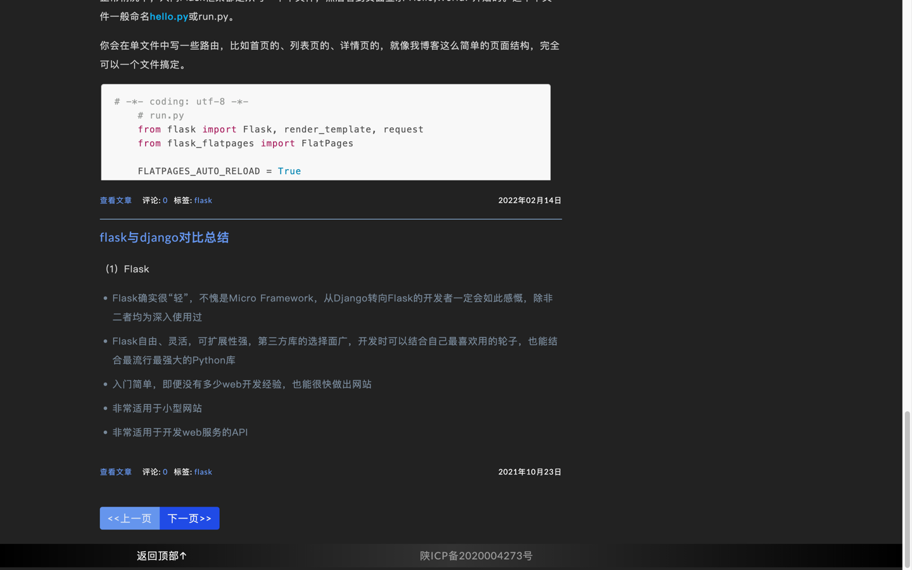

# flaskblog
*使用flask搭建的个人博客并使用docker部署*

样例: youyangfan.work

博客头部：

博客底部：

### 此文分为安装和部署两部分
## 1.安装：
clone:
```
$ git clone git@github.com:Alex-1992/flaskblog.git
$ cd bluelog
```
创建虚拟环境并安装依赖:
使用 venv/virtualenv + pip:
```
$ python -m venv env  # use `virtualenv env` for Pyth
$ source env/bin/activate  # use `env\Scripts\activat
$ pip install -r requirements.txt
```
或使用 Pipenv（推荐）:
```
$ pipenv install --dev
$ pipenv shell
```
生成测试数据并运行:
```
$ flask forge
$ flask run
* Running on http://127.0.0.1:5000/
```
测试账号:
* username: `admin`
* password: `admin`

博客的邮件系统需要私人smtp账户信息，想要使用完整的邮件功能，

还需要在根目录下创建一个 .env 文件，写入如下信息：

```
# 程序秘钥，一个随机字符串
SECRET_KEY = youyangfan

# 自己的smtp账户信息
MAIL_SERVER = smtp服务器地址
MAIL_USERNAME = 自己的smtp账号
MAIL_PASSWORD = 密码(有的网站需要提供授权码)
```

程序默认为开发环境，使用sqlite存储数据，生产环境下优先从环境变量读取数据库URI，

建议使用更健壮的DBMS如MySQL，这需要在 .flaskenv 文件中修改生产环境变量

并在 .env 文件中写入数据库URI

```
# .flaskenv中
FLASK_ENV = production

# .env中
SQLALCHEMY_DATABASE_URI = 数据库名+连接引擎://用户名:密码@数据库路径
```
## 2.部署：
### 本地：
切换至项目根目录，根据dockerfile创建本地镜像：

*-t 指定镜像名和标签*
 
*. 表示用当前目录下的dockerfile创建镜像*
```
$ sudo docker build -t flaskblog:dev .
```
查看创建的镜像：
```
$ docker images 
```
测试运行本地镜像：
 
*-it 等同于 -i  -t 表示以交互模式运行容器并为容器分配一个伪输入终端*
 
*-p 指定端口映射，格式为：主机(宿主)端口:容器端口*
```
$ docker run -it -p 80:80  flaskblog:dev
```
注册dockerhub账号 www.dockerhub.com 并创建远程仓库 类似git
 
将本地image与仓库项目关联:
 
*username为你在dockerhub注册的账号*
 
tag表示将本地flaskblog:dev 与远程仓库 username/flaskblog:dev 关
```
$ docker tag flaskblog:dev username/flaskblog:dev
```
登录后才可以push到dockerhub
```
$ docker login
```
将本地image提交到dockerhub
```
$ docker push username/flaskblog:dev
```
### 服务器：
安装docker，不同服务器安装方式不同，这里略过
 
从dockerhub拉取远程仓库镜像
```
$ docker pull username/flaskblog:dev
```
测试临时运行docker镜像：
```
$ docker run -it -p 80:80  username/flaskblog:dev
```
查看容器运行状态：
```
$ docker ps
```
生产环境以后台方式运行docker镜像：
 
*-d 表示以守护进程的方式在后台运行*
```
$ docker run -itd -p 80:80  username/flaskblog:dev
```